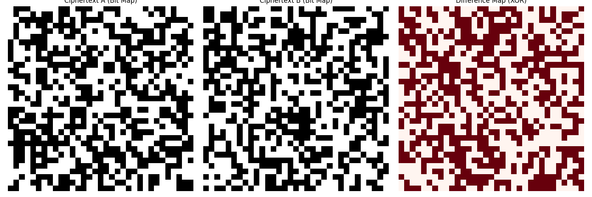

# Báo cáo Phân tích Định lượng & Hình ảnh (Security Analytics & Visualization)
Statistical analysis performed over 100 random trials.

## 1. Phân tích Entropy Trung bình (Average Entropy)
*   **Số lượng file phân tích**: `2`
*   **Entropy Trung bình**: `6.4133` bits/byte
*   **Độ lệch chuẩn (STDEV)**: `0.1184`

## 2. Hiệu ứng Thác đổ Thống kê (Statistical Avalanche Effect)
*   **Avalanche Effect Trung bình**: `50.10%` (Lý tưởng: 50%)
*   **Độ lệch chuẩn (STDEV)**: `±1.52%`

## 3. Minh chứng Hình ảnh (Cryptographic Visualization)

**Giải thích hình ảnh**:
*   **Ciphertext A/B**: Bản đồ bit của 2 vault có nội dung gốc chỉ khác nhau 1 bit. Bạn có thể thấy chúng trông như nhiễu trắng (vô trị), không có pattern.
*   **Difference Map**: Kết quả XOR giữa 2 bản mã. Màu đỏ bao phủ ~50% diện tích cho thấy sự thay đổi lan tỏa (Diffusion) toàn bộ file thay vì chỉ khu biệt ở 1 block.